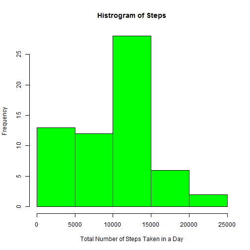
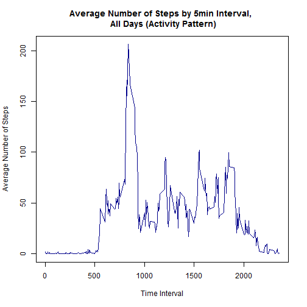
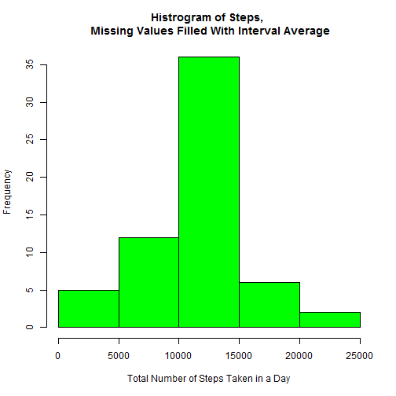

---
title: "Reproducable Research Project 1"
output: html_document
---  
  
The following is a step-by-step analysis of data from a device monitoring the number of steps registered by a subject during 5 minute intervals throughout the day over the span of several days. The data was obtained from: https://d396qusza40orc.cloudfront.net/repdata%2Fdata%2Factivity.zip
This R program uses the lattice package and requires it be installed.
  
###Load the data
First, we load the data, ensuring the activity.csv file downloaded from the above link is in the working directory:

```r
activity <- read.csv("activity.csv")
```

###Mean Total Steps Taken
Next, we use tapply to summarize the total number of steps taken per day for a histogram:

```r
atot <- tapply(activity$steps, activity$date, sum, na.rm = TRUE)
```

Then, generate the histogram of total number of steps taken each day (ignoring NA values):

```r
hist(atot, xlab = "Total Number of Steps Taken in a Day", main = "Histrogram of Steps", col = "green")
```

 

Next, we calculate the mean and median of total number of steps taken per day (rounded to 2 decimals):

```r
amean <- round(mean(atot),2)
amedian <- median(atot)
```
The mean number of steps per day is **9354.23** and the median is **10395**

###Average Daily Activity Pattern
Next, we look at the average number of steps taken per each daily 5 minute interval across all days in the data-set (again ignoring NA values.)

The first step is to summarize the data by interval mean to prepare it for a line plot:

```r
aint <- tapply(activity$steps, activity$interval, mean, na.rm = TRUE)
```

Then create the plot:

```r
plot(names(aint),aint,type = "l",xlab="Time Interval",ylab="Average Number of Steps",
     main = "Average Number of Steps by 5min Interval, \n All Days (Activity Pattern)",col="darkblue")
```

 

Next, we want to determine the 5 minute interval, averaged across all days, with the greatest number of steps:

```r
amax <- names(which.max(aint))
```

The interval with the gratest number of steps, averaged across all days, occured at minute: **835**

###Input Missing Values
There are several intervals in the data-set that are missing values and are coded as "NA".
The following code determines the number of missing values:

```r
nummissing <- sum(is.na(activity$steps))
```
There are **2304** "NA" values in the dataset

In order to deal with these "NA" values to attempt to reduce the bias they create, we will fill in each missing step observation with the average for that 5min interval, as calculated above.

To do this, we can create a dataframe from the interval average array, and merge it with the base activity data-set by interval number, this will align an average with each interval observation so we can fill in the missing values:

```r
aint <- as.data.frame(as.table(aint))
names(aint) <- c("interval", "avg_steps")
amerge <- merge(activity, aint, by = "interval")
```
Now we can create a new "filled_steps" variable that interpolates the exisitng values with the average values for missing observations:

```r
amerge$filled_steps <- amerge$steps
my.na <- is.na(amerge$steps)
amerge$filled_steps[my.na] <- amerge$avg_steps[my.na]
```

Now we can create a histogram to compare the interpolated results with the initial results that ignored missing values. Mechanically, this will follow the same procedure as the initial histogram.
First we use tapply to summarize the total steps per day, but this time use the new "filled_steps" variable we created:

```r
atotfill <- tapply(amerge$filled_steps, amerge$date, sum)
```
Then the histogram is created:

```r
hist(atotfill, xlab = "Total Number of Steps Taken in a Day", 
     main = "Histrogram of Steps, \n Missing Values Filled With Interval Average", col = "green")
```

 

We can also calculate a new mean and median for total steps, given the interpolated data:

```r
fillmean <- format(mean(atotfill), scientific = FALSE)
fillmedian <- format(median(atotfill), scientific = FALSE)
```

The new mean is: **10766.19**, and the new median is: **10766.19**

Given the filled in missing values, we see that the frequency distribution of total steps per day is more symetric, with a greater max value, greater mean, and lesser median (identical to the mean in this case)

###Differences in Activity Patterns Between Weekdays and Weekends
For the final step in this analysis, we will evaluate what differences, if any, we see when looking at activity patterns between weekdays and weekends.

To do this, we first create a new factor variable that will denote weekdays vs. weekends. Mechanically, we can first use R's built in weekdays() function to convert each date to a day of the week. We then replace "Saturday" and "Sunday" with "weekend", and replace everything else with "weekday":

```r
amerge$week_day_end <- weekdays(as.Date(amerge$date))
amerge$week_day_end[amerge$week_day_end %in% c("Saturday", "Sunday")] <- "weekend"
amerge$week_day_end[amerge$week_day_end != "weekend"] <- "weekday"
```

Next, we create a table for a 2-panel plot that we can use to look at any potential differences in average 5-min interval stepping between weekdays and weekends. This table will summarize the average step value across all days by interval and weekday/weekend designation.

```r
amergetab <- with(amerge, tapply(filled_steps, list(interval, week_day_end), mean))
amergetab <- as.data.frame(as.table(amergetab))
names(amergetab) <- c("interval","week_day_end","avg_steps")
amergetab$interval <- as.numeric(as.character(amergetab$interval))
```

Now, we can use the lattice package to create a 2-panel plot displaying the results, with a dashed line indicating the summary mean of weekend vs weekday steps per interval.

```r
library(lattice)
```

```r
xyplot(avg_steps ~ interval | week_day_end, data = amergetab, type = 'l', layout = c(1,2), xlab = "Time Interval", 
       ylab = "Average Number of Steps", panel = function(y, ...){
            panel.xyplot(y, ...)
            panel.abline(h = mean(y), lty = 2)
})
```

 

We can see that weekdays have a slightly lower mean number of steps, with a higher max just prior to the middle of the time interval estimates. They also have a slightly flatter trend the rest of the day when compared with weekends, where the number of steps seems to be more consistently distributed throughout the day.
